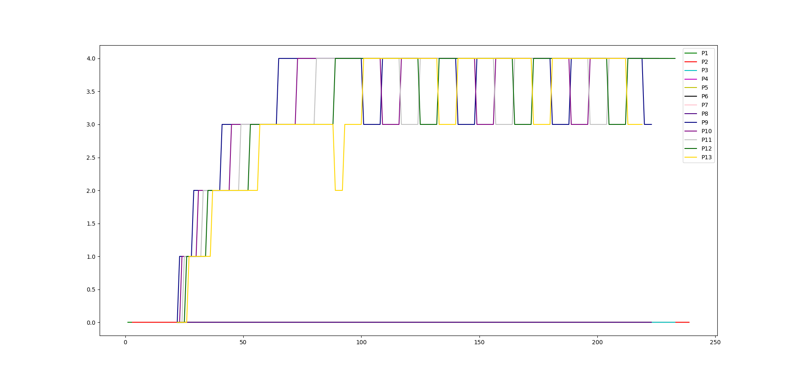
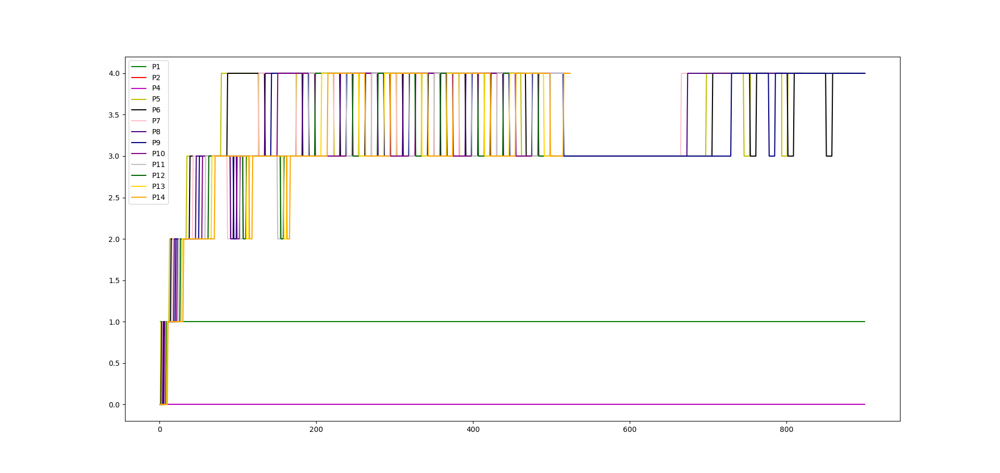
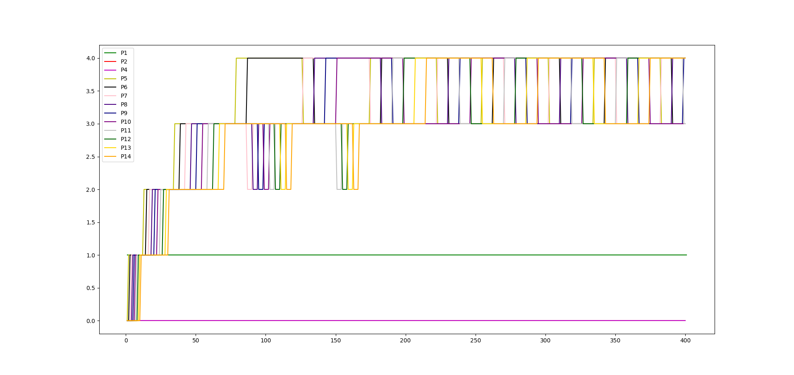
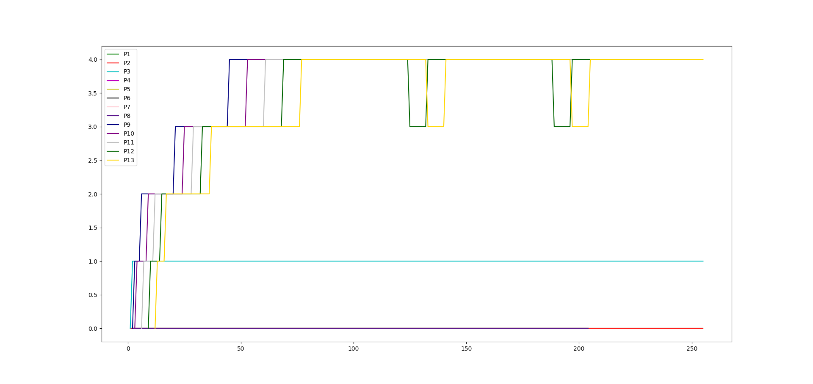

# OS Assignment - 4: Modified XV-6

**Name:** Suyash Vardhan Mathur  
**Roll no.:** 2019114006  

## Functionalities implemented
I did the work of this assignment on top of the repo that was shared in the tutorial. Thus, the implementation of `waitx` and its associated `update_time()` functions, etc. has been taken from Kannav's repo. Further, the `schedulertest.c` file shared was used and modified for various levels of testing in this assignment.
### Strace
* I added the syscall `trace` to the kernel.
    * This sycall allows the newly added `tracemsk` variable in `proc struct` in `proc.h` to be set to a particular value.
    * In this variable `tracemask`, the ith set bit in the variable represents that the ith syscall is being traced.
    * The default value of this variable is set to 0. This value is set in the `allocproc()` function.
    * Added a `sys_trace()` function in `sys_proc.c` to enable the syscall. Also, added relevant bits in other files necessary for syscall.
* I added the user program strace.
    * For this, I added `$U/_strace` to UPROGS in Makefile.
    * Added user program in the file `user/strace.c` that forks a chile process, and runs the `trace` syscall on it and then executes the remaining arguments of the `strace` user program.
    * Added the stubs in other files to complete the working of the user program.
* Modified the `syscall` function to print the tracing outputs.
    * Now, if the ith number syscall is called, and the ith bit is set in the tracemask of that process, then we print all the trace of that syscall.
    * In order to do this, I hardcoded category-wise syscalls based on the number of arguments in them, and extracted these args.
    * Then, I ran the syscall and took the return value of the syscall. In the end, I printed all the values based upon the category of the syscall.
    * This printing of values after running of syscall allowed non-printing of `exit` and certain instances of `kill` to be handled automatically.

### Scheduler selection
* In order to select the scheduler that we run, I modified the makefile to set a macro `SCHEDULER` which takes value based upon the flag that is passed to it.
* The corresponding values in the scheduler are:
    0->Round Robin   
    1->FCFS  
    2->PBS  
    3->MLFQ
### FCFS Scheduler
* For this scheduler, we iterate over the proc table, and select the process with the minimum `ctime`.
* This value of `ctime` is set equal to number of ticks at the time of process creation, and thus, this is the time of creation of the process.
* I acquire locks for every process that I check.
* After finding the lowest ctime proc, I set its status to running, incrementing the `scheduled_count` variable.
* Also, I modified the file `kernel/trap.c` to disable processes being yeilded due to clock interrupts. Changes were made in the `kerneltrap` and the `usertrap` function.
### PBS Scheduler
* For this scheduler, I added the variables of `static_priority`, `niceness`, `stime` for calculating the dynamic priorities.
* Then, I added the syscall `set_priority` syscall, along with the `setpriority` user program(in `users/setpriority.c`) to change the priority to a specific value.
    * This also resets the niceness to 5, and also sets the pbs_runtime and sleeptime values to 0.
    * I used a different variable `pbs_rtime` instead of `rtime` for niceness computations, since this is set to 0 in `set_priority`, which would mess up benchmark values. 
    * Further, after the syscall, if the new dynamic priority(==static priority) is lesser than the previous dynamic priority(used during scheduling), then the process is yielded and reschedulig takes place.
* The value of niceness is changed only after the scheduled process completes its run(as stated in the requirements).
* The dynamic priority is calculated for all the processes before selecting the one to be scheduled.
* Now, the process with the highest priority(least value) is selected. In case of ties, number of times the process was scheduled and ctime are used to resolve the process to be selected.
* Now, we run the process, and after the process gets executed, update the niceness of the process.
### MLFQ Scheduler
* For this scheduler, I initialized 5 arrays(queues) numbered 0 to 4, with 0 having the highest priority.
* During the initialization of XV-6, I set all the queues to empty.
* After that, every time during fork and userinit, I insert the process into the **0th queue**. For convenience, I created functions to insert a process into the queue and to delete the ith process from the queue.
* Further, at the time of inserting into the 0th queue through fork, I check if the current process being executed(through `myproc()`) is in a lower priority queue(1-4), then i yield() and the currently running process gets preempted
* Now, at the start of the scheduler, I check for ageing in the queues.
    * **For ageing here, as well as for the wtime printed in MLFQ's procdump, I consider the queue wait time as the number of ticks for which the process in that queue was in the RUNNABLE state. This value is what is used for implementing ageing. This was decided upon after clarification from a TA.**
    * The maximum age that is allowed is defined in the MAX_OLD_AGE parameter.
    * If the wait time of the process has gone beyond the MAX_OLD_AGE value, then it gets inserted into the higher priority queue(except if it is in 0th queue).
* After this, I find the first process in a non-empty highest prioirity queue, and if it is runnable, select it for running. Now, we set its state to running and give it CPU to run.
* In order to implement time slicing, I made modifications in `kernel/trap.c` and modified such that if the current queue run time exceeds the ticks limit(1 << queue_no), then the process gets yielded.
    * Also, in this case, I set a flag `overshot` to 1.
* Now, after the process has finished running, I check for the `overshot` flag, in which case I increase its queue number. Now, if the process is still runnable, then I insert it back into the queue according to its current queue_number.
* Further, for processes that themselves relinquish control(for I/O, etc.), they go into the sleep state, and they are not **pushed back into the queue**. However, when the I/O stops, they reach the `wakeup` function, where they are added back into the queue they were previously in before going to sleep.
### Procdump
* For procdump, I print the relevant information as was given in the assignment PDF. Thus, I display the PID, priority(MLFQ and PBS only), state, rtime, wtime, nrun, and q_i(MLFQ only).
* Note that for Zombie processes, the priority is printed as -1 in MLFQ.
* Note that the `q_i` values in procdump denote the total time for which the process remained in that particular queue(as a RUNNING/RUNNABLE/SLEEPING) process.
* Note that the queue wait time is taken to be the time that the process spends in the RUNNABLE state in that queue. This was because it made sense since the SLEEPING procsses aren't considered to exactly be a part of the queue as per the assignment PDF.
* Note that after running `set_priority()` in PBS, the values of rtime and wtime may become weird, since they are supposed to be reset when `set_priority()` is run. To avoid this, I changed to use a differnt variable `pbs_rtime` so that the benchmarks dont get disturbed for PBS.
### Bonus
* For the bonus, I modified the clock interrupt to print the output of procdump after each tick.
* Now, I piped the output of the make command into the `tee` commmand in order to store the procdump info into the file.
* Now, I parsed this raw data using python as well as manually cleaned it, and plotted it using myplotlib(code in `Graphs/graph_plot.py`).

## Answer to Specification 2 MLFQ question
This scheduler algorithm can be exploited by a process by doing redundant I/O just before its allotted timeslice(equal to 2^(queue_no) ticks) gets over. Now, when it is goes out of the queueuing system and comes back, its run time for that queue would again be set to 0 when it is pushed to the back of the queue. Thus, it can forever continue to remain in a high priority queue, and this is achieved by spoofing the CPU into thinking that it is an I/O bound or interactive process that needs higher priority, while in reality it could be a CPU bound process. Thus, despite not being I/O bound process, it can continue getting more priority and remain in a high priority queue.

## Benchmark program performance
I tabulate the outputs of the `schedulertest` code given:
### 10 PROCS CREATED(5 I/O and 5 CPU heavy)[10 CPU heavy in case of FCFS]:
| Scheduler type | Avg Wait time | Avg Run time  |
|----------------|-------------- |---------------|
| Round Robin    | 183           | 21            |
| FCFS           | 195           | 43            |
| PBS            | 182           | 20            |
| MLFQ           | 167           | 20            |

### 20 PROCS CREATED(10 I/O and 10 CPU heavy)[20 CPU heavu in case of FCFS]
| Scheduler type | Avg Wait time | Avg Run time  |
|----------------|-------------- |---------------|
| Round Robin    | 282           | 20            |
| FCFS           | 385           | 41            |
| PBS            | 294           | 21            |
| MLFQ           | 278           | 20            |
### Performance comparison
In case of 10 processes:
* The average wait time of MLFQ is much better as compared to the default Round Robin. This is because the the processes that wait for too long get CPU through the facility of ageing. This causes wait times to never exceed a certain threshold.
* The average wait time of FCFS is much worse than that of Round Robin and other schedulers. This is because FCFS keeps execution one process for a much longer time, and this leads to much higher wait times. Thus, the non-preemptive nature of FCFS causes such high times. Also, the testing runs 10 CPU heavy processes for FCFS, rather than 5 I/O heavy and 5 CPU heavy in case of other schedulers. This explains the double run time(since twice the number of CPU bound processes run, which have significant run time as compared to the ~0 runtime of the I/O heavy processes).
* The average wait time of PBS is almost same as RR. The little improvement is because of better scheduling through niceness getting updated with sleeptime and runtime considerations. However, this improvement is rather small in terms of 10 processes(and doubles when the number of processes is doubled).
* The little increase in average run time in case of RR might be explained by more preemption happening, which increases the run time by a very small bit.
* The almost same run times in all the processes(even FCFS, since 5 CPU heavy processes would have taken same amount of runtime), shows that the runtime is most dependent upon the structure of the process itself rather than the scheduler that runs it.
* Due to high frequency of preemption in case of Round robin and MLFQ, they have better wait times than the others, and do better scheduling to spread the wait times.

In case of 20 processes:
* The improvements of MLFQ seem lesser in case of 20 processes. This might be explained by more overhead in terms of moving more processes between the queues and checking their parameters and updating them.
* Despite the overheads, again MLFQ performs the best.
* As expected, the run time of FCFS is much higher due to it running the CPU heavy processes(which are taking much more run time). The difference is much more pronounced in this case(since more processes means more waiting for each one to finish).
* The wait time in case of FCFS is much higher than the others. This is in line with the previous observations.

From the above benchmarking, MLFQ seems to be a better scheduler than Round Robin. However, we must note that its scheduling can be exploited by processes that go to sleep simply to stay in high priority queues, even if they are not doing I/O. Thus, CPU heavy processes might spoof I/O activities to maintain high priority.

### BONUS
I obtained the following graph with the given benchmark code, with the MAX_AGE_LIMIT kept as 30 ticks:

The code that I used to generate this graph can be found in `./Graphs/` directory.
Some observations:
* Initially, all the runnable(non-sleeping) processes start in the 0th queue, and then after exceeding the ticks, move to 1st queue and so on.
* The sleeping processes, which were inserted in the 0th queue, remain there until the end when they quickly exit the queue after finishing.
* The preemption and moving into lower priority queues continues until 3rd queue, where in the duration that P9, 10, 11, 12 run, P13 gets starved and is moved to the higher priority queue(queue 2), where it is executed and then it returns into queue 3.
* Again in queue 3, P13 is the only process(as others had moved to queue 4), and thus it again gets executed, and moves to queue 4.
* By this time, P9 had gotten starved, and so it moved to the higher priority queue(queue 3), where it again gets executed. Smilarly, by the time P9 completes execution, P9 gets starved and goes into queue 3 and runs there. Same for P10, and thus, the processes from here on keep starving and coming down to queue 3, and after executing, the next process which had starved enters queue 3 to be executed.
* Thus, minimal execution happens around this point in queue 4, as all the processes get starved and move to queue 3 to get executed.

I also generated another graph where some processes ran, then slept and then ran again. The complete graph is:

The graph for the first 400 ticks is:

Similar observations can be seen here, along with the fact that some processes remain stuck in certain queues that they reached after running when they start to sleep. For example, the very long P14 line, as well as the long wait of P9 are due to the same reasons. Similar kind of exchange between 3rd and 4th queue, and 2nd and 3rd queue can be seen here(this had lesse AGEING limit).

Another graph that I obtained with normal benchmark code with increased STARVATION LIMIT of 50 is:

In this case, the to-and-fro between the queues is much lesser, since it takes much more ticks for the process to starve.